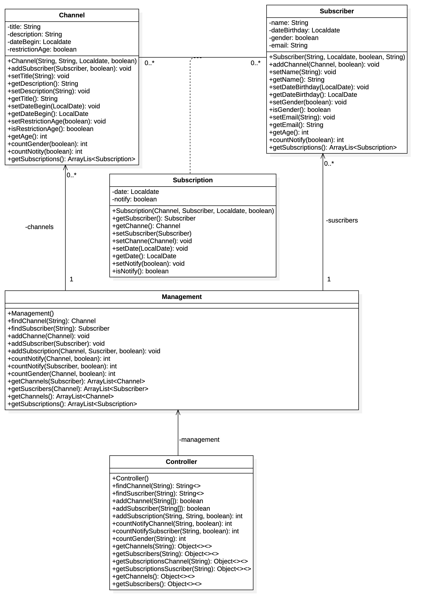

# Canales - Subscriptores

Ejemplo de gestión de Canales y Subscriptores, implementando una asociaición de muchos a muchos. Un canal tiene varios Subscriptores, y un Subscriptor se asocia con muchos canales, se usa una clase asociación.

La implementación de las clases se basa en el siguiente Diagrama:

La clase asociación es `Subscription` y permite asociar un Canal con muchos Subscriptores y a un Subscriptor con muchos Canales

